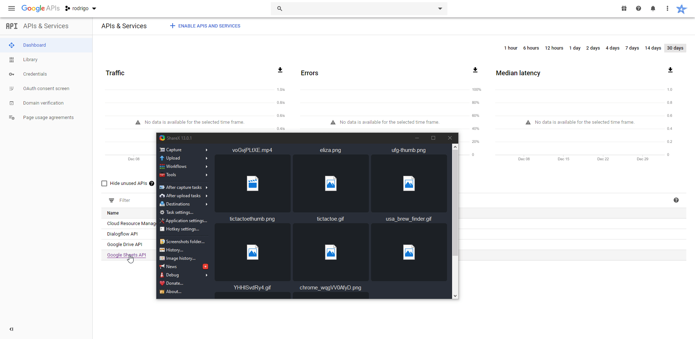
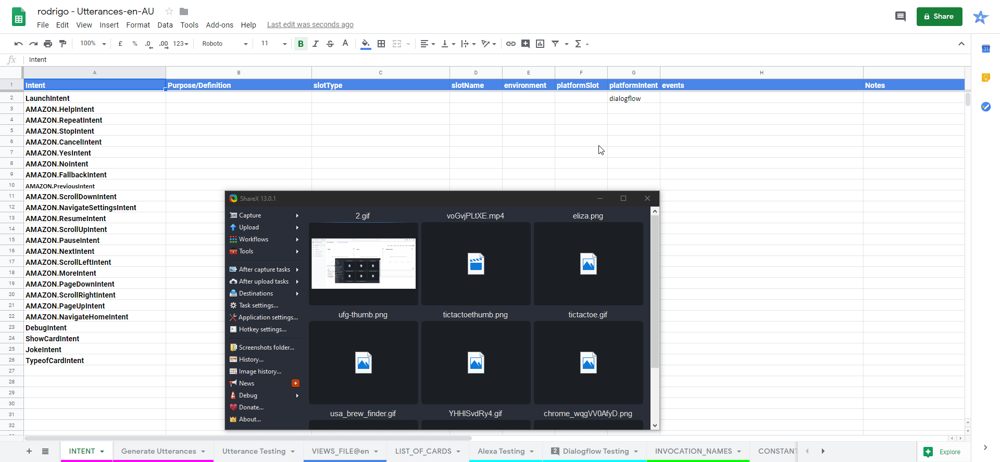
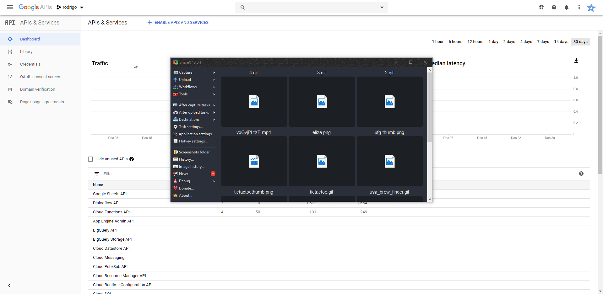

# Getting <%= chatbotName %> Set up.
### This guide will help you setup your chatbot, once setup you will easily be able to change it's design and content. Use live preview in VS code or your favourite text editor to view the helpful gifs below.

## Set up <%= chatbotName %>-voxa and Dialogflow.

* cd into the folder and run *npm install* or *yarn install* whichever you prefer.

``` terminal
cd <%= chatbotName %>-voxa 

yarn install or npm install
```

* Rename this.copy.env and this.copy.gitignore to .env and .gitignore.

*  Go to [Dialogflow](https://www.dialogflow.com), log in and select create new agent. Type in <%= chatbotName %> or what you want to call the agent and click create.


* go to the settings page and grab the project id then head to https://console.developers.google.com/apis/dashboard?project=YOUR_PROJECT_ID_HERE

* Click enable APIS & services and enable the *google drive api* and the *google sheet api*. Create credentials for a Web Server to access Application Data. Name the service account and grant it a Project Role of Editor. Download the JSON file. Copy the JSON file to your <%= chatbotName %>-voxa directory and rename it to client_secret.json



* upload the <%= chatbotName %> - Utterances-en-AU.xlsx file to your google drive and **make sure  you save it AS A GOOGLE SHEET DOCUMENT**. You can then **delete the xlsx version from your google drive after it has been converted to a google sheet document**.

* open the <%= chatbotName %> - Utterances-en-AU **GOOGLE SHEET** and click share in the top right. Copy and paste the client email from the client_secret.json file into the box and click ok.

* Copy the link for your google sheet up until the / before *edit* and paste in into the interaction.json file where it says *paste your spreadsheet url here*



* in the command line in your <%= chatbotName %>-voxa folder run the following command 

``` terminal
yarn interaction

or 

npm run interaction
```

* This command will access the spreadsheet and copy all the utterances, slots, slot types and views and create a speech-assets folder an src/language resources folder and src/content folder. It will then zip you speech assets/dialogflow folder so that you can upload it to dialogflow.

* Go to [Dialogflow](https://www.dialogflow.com), click the settings cog > Export and import > Restore from Zip. Navigate to your <%= chatbotName %>-voxa folder and upload *df-agent.zip*. 

## Set up the database 

* open the .env file in your <%= chatbotName %>-voxa folder and change the username and password to your mongodb username and password.

* In terminal run the command: 

``` terminal 
yarn dbseed

or

npm run dbseed
```

* This will seed the cards and quickreplies json files located at src > services > db > models > seedfiles folders. This is where you can edit the content of your cards and quickreplies. 

## Testing

* To test that your voxa is working make sure you have [Ngrok](https://ngrok.com/) installed. In a seperate terminal window run: 

``` terminal
ngrok http 3500
```
* Copy the *https* link that it gives you and in dialogflow click fullfilment and then paste in the link followed by /googleAction. It should look something like https://e646d358.ngrok.io/googleAction. Click save.

* in your <%= chatbotName %>-voxa folder in terminal run 

``` terminal
yarn watch

or 

npm run watch
```

* This will start the server and your webhook from dialogflow will be pointing to this address, you can then use the test input on the righthandside of dialogflow to check it is working. Try typing "hi".

## Editing the content of your chatbot.

* You can edit all of the replies and utterences for your chatbot in the google spreadsheet you setup except for the small talk, to edit this you must manipulate the customSmalltalkResponses_en.json file.

* Edit your quick replies and cards by manipulating the json files located at src > services > db > models > seedfiles.

* Once you have updated the content run the following command to seed and update the database with your changes:

``` terminal 
yarn dbseed

or

npm run dbseed
```

## Set up <%= chatbotName %>-serverless-backend.

* cd into the folder and run *npm install* or *yarn install* whichever you prefer.

``` terminal
cd <%= chatbotName %>-voxa 

yarn install or npm install
```

* Rename this.copy.env and this.copy.gitignore to .env and .gitignore.

* in the .env file change the username and password in the Mongodb Url to your mondodb username and password. 

* Head to https://console.developers.google.com/apis/dashboard?project=YOUR_PROJECT_ID_HERE. Click credentials > create credentials > service account key. Make a new service account called dialogflow-client and give it the role of *Dialogflow API Client*. Download the JSON file and keep it somewhere safe OUTSIDE your project folders. 



* open the JSON file and copy and paste the **project id, private key and client email** into the appropriate fields in the **.env** file **AND** the config/dev.js file. Also insert your language e.g en-AU or en-US and session ID which you can make up e.g <%= chatbotName %>-session.

## Testing 

* To test make sure that your voxa is running (yarn watch) and ngrok is running and the correct URL is in the dialogflow fulfillment. Run the following command: 

```  terminal
yarn dev

or 

npm dev 
```

* You can then use postman to test the http://localhost:5000/api/df_text_query route with the following JSON. 

```JSON
{
	"text": "hi",
	"userId": "asdi123214"
}
```

* You can also test the to test the http://localhost:5000/df_event_query route with the following JSON. 

```JSON
{
	"event": "Welcome",
	"userId": "asdi123214"
}
```

* Alernatively you can run the following command which will use prewritten tests with supertest to make sure the routes are working using a test mongo db database: 

``` terminal 
yarn test

or

npm test
```

## Set up <%= chatbotName %>-frontend.

* cd into the frontend folder and run *npm install* or *yarn install* whichever you prefer.

``` terminal
cd <%= chatbotName %>-voxa 

yarn install or npm install
```

* Rename this.copy.gitignore to .gitignore.

* Replace the public/img/logo.png file with your own 100*100 pixel logo.

* Replace the public/favicon.ico with your own 16*156 pixel icon. 

* make sure you have the [Netlify CLI](https://docs.netlify.com/cli/get-started/) installed and that you are logged into netlify in the terminal. 

* Deploy the application: 

```terminal
yarn deploy

or 

npm run deploy
```

* Once deployed open the src/helpers/variables.js file and change the deployedURL to what you were given by netlify. IT is important the make sure that the deployed URL ends with '/'. e.g "https://<%= chatbotName %>-bot.netlify.com/" The apiURL is set to localhost so if your voxa is running (yarn watch) in conjunction with ngrok, the dialogflow fulfilment url is correct and the backend is runnning (yarn start) you will be able to test the app. 

* Once you deploy your backend you can change the apiURL in this folder to the route you are given by your AWS Lambda. 

* To edit the appearance of the chatbot you can change the css variables in the src/style-variables.scss file.

## Deploy the <%= chatbotName %>-serverless-backend and <%= chatbotName %>-voxa

* make sure you have [serverless CLI](https://serverless.com/cli/) and the [AWS CLI](https://docs.aws.amazon.com/cli/latest/userguide/cli-chap-configure.html) installed and configured properly. 

* Depending on whether you are deploying to staging or production run the following command. 

```terminal
NODE_ENV=staging sls deploy
NODE_ENV=production sls deploy
```

* Once each is deployed you can change the fulfillment URL in dialogflow to the one provided by your voxa deployment and the apiURL in <%= chatbotName %>-frontend/src/helpers/variables.js to the one provided by your backend deployment. 

## Copy your injection script and add your chatbot to any website. 

* Once your frontend is deployed you will have an injection script button at the top of your chatbot. This will only appear on your netlify deployment, not locally and not if the injection script is being used on an alternate site. 


* Click this button and your custom injection script will be copied to your clipboard and vchat will give you instructions on how to use it. 

* If the injection script button is not appearing go to src > helpers > variables.js and make sure the url is in the correct format with a forward slash '/' at the end of the address e.g "https://<%= chatbotName %>-bot.netlify.com/".